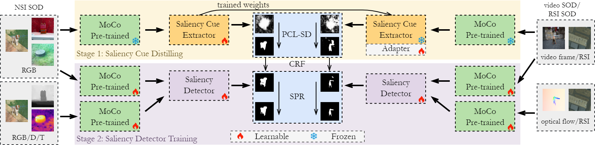

# Activation-to-Saliency version3 (A2S-v3)
Source code of '[Unified Unsupervised Salient Object Detection via Knowledge Transfer]()', which is accepted by IJCAI 2024.
<div align=center>

</div>

This study builds upon [moothes](https://github.com/moothes)'s earlier research, specifically [A2S-v2](https://github.com/moothes/A2S-v2). Consequently, most of the code implementation remains consistent or bears similarity to theirs. For further insight into the A2S series of studies, readers are encouraged to consult the code repository of the preceding work [A2S-v2](https://github.com/moothes/A2S-v2) and [A2S](https://github.com/moothes/A2S-USOD).

## Environment
Python 3.9.13 and Pytorch 1.11.0. Details can be found in `requirements.txt`. If your environment can run [A2S-v2](https://github.com/moothes/A2S-v2), then it should also be able to run our code.
## Data Preparation

## Training & Testing


### Stage 1
```
## Training
# Training for RGB SOD task
python3 train.py a2s --gpus=[gpu_num] --trset=c

# Split training for single multimodal task
python3 train.py a2s --gpus=[gpu_num] --trset=[d/o/t]

# Joint training for four multimodal tasks
python3 train.py a2s --gpus=[gpu_num] --trset=cdot

## Testing
# Generating pseudo labels
python3 test.py a2s --gpus=[gpu_num] --weight=[path_to_weight] --vals=[cr/dr/or/tr] --save --crf

# Testing on test sets
python3 test.py a2s --gpus=[gpu_num] --weight=[path_to_weight] --vals=[ce/de/oe/te] [--save]
```

After the training process in stage 1, we will generate pseudo labels for all training sets and save them to a new ```pseudo``` folder.

### Stage 2
```
## Training
# Training for RGB SOD task
python3 train.py cornet --gpus=[gpu_num] --stage=2 --trset=c --vals=ce

# Training for RGB-D, RGB-T or video SOD tasks
python3 train.py midnet --gpus=[gpu_num] --stage=2 --trset=[d/o/t] --vals=[de/oe/te]

## Testing
python3 test.py [cornet/midnet] --gpus=[gpu_num] --weight=[path_to_weight] --vals=[de/oe/te] [--save]
```

## Acknowledgement
Our idea is inspired by [A2S-v2](https://github.com/nnizhang/VST) and [afa](https://github.com/rulixiang/afa). Thanks for their excellent works. 

## Citation
If you think our work is helpful, please consider cite:
```

```
Please also consider citing pioneering work A2S-v2 and A2S:
```
@inproceedings{zhou2023texture,
  title={Texture-Guided Saliency Distilling for Unsupervised Salient Object Detection},
  author={Zhou, Huajun and Qiao, Bo and Yang, Lingxiao and Lai, Jianhuang and Xie, Xiaohua},
  booktitle={Proceedings of the IEEE/CVF Conference on Computer Vision and Pattern Recognition},
  pages={7257--7267},
  year={2023}
}

@ARTICLE{zhou2023a2s1,
  title={Activation to Saliency: Forming High-Quality Labels for Unsupervised Salient Object Detection}, 
  author={Zhou, Huajun and Chen, Peijia and Yang, Lingxiao and Xie, Xiaohua and Lai, Jianhuang},
  journal={IEEE Transactions on Circuits and Systems for Video Technology}, 
  year={2023},
  volume={33},
  number={2},
  pages={743-755},
  doi={10.1109/TCSVT.2022.3203595}}
```

