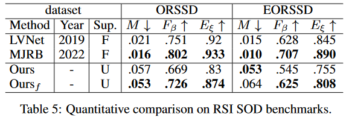

# Activation-to-Saliency version3 (A2S-v3)
Source code of '[Unified Unsupervised Salient Object Detection via Knowledge Transfer]()', which is accepted by IJCAI 2024.
<div align=center>

</div>

This study builds upon [moothes](https://github.com/moothes)'s earlier research, specifically [A2S-v2](https://github.com/moothes/A2S-v2). Consequently, most of the code implementation remains consistent or bears similarity to theirs. For further insight into the A2S series of studies, readers are encouraged to consult the code repository of the preceding work [A2S-v2](https://github.com/moothes/A2S-v2) and [A2S](https://github.com/moothes/A2S-USOD).
## News
- [2024.8.7] We conducted a presentation at session CV: Recognition of the main conference and the relevant materials have been uploaded. 
- [2024.5.27] Our method's prediction results on [VDT](https://github.com/VDT-2048/VDT-Dataset) dataset can be found at [baidu link](https://pan.baidu.com/s/1bTGEWdmAPfwWnCLTJOxW5A)(cdck). Our method can easily perform inference on other tasks or datasets, with slight modifications in dataset settings. 
- [2024.4.24] The manuscript is now available at Arxiv [2404.14759](https://arxiv.org/abs/2404.14759).
- [2024.4.24] The supplementary material is now available at [Github](https://github.com/I2-Multimedia-Lab/A2S-v3/blob/main/figures/A2S-v3_supp.pdf).
- [2024.4.17] Our paper has been accepted by [IJCAI 2024](https://ijcai24.org/).

## Advancements
### 🚀 More stable distilling of saliency cues
We introduce the concept of curriculum learning, wherein progressively hard samples are incorporated into the training process. This approach aims to stabilize the training process and mitigate the risk of pattern collapse. 
### 💡 Improved pseudo-label refinement
We integrated the Online Label Refinement (OLR) technique proposed in [A2S](https://github.com/moothes/A2S-USOD) with the real-time pixel refiner presented in [afa](https://github.com/rulixiang/afa), aiming to introduce a more robust strategy for updating pseudo labels. Our results showcase enhanced performance in self-supervised learning.
### 🔥 Adapter-tuning driven knowledge transfer
We employ the Adapter-tuning methodology to transfer knowledge from Nature Still Image (NSI) SOD tasks to non-NSI SOD tasks (e.g., video SOD, remote sensing image SOD), yielding commendable transfer performance.

## Environment
Python 3.9.13 and Pytorch 1.11.0. Details can be found in `requirements.txt`. If your environment can run [A2S-v2](https://github.com/moothes/A2S-v2), then it should also be able to run our code.
## Data Preparation
The datasets we used for five different SOD tasks are as follows:
 Task &nbsp; &nbsp; &nbsp; &nbsp; | Train sets | Test sets 
--- | --- | ---
[RGB](https://drive.google.com/file/d/17X4SiSVuBmqkvQJe_ScVARKPM_vgvCOi/view?usp=sharing) | **[cr]** ```DUTS-TR```| **[ce]** ```HKU-IS```, ```PASCAL-S```, ```ECSSD```, ```DUTS-TE```, ```DUT-OMRON```,  ```MSB-TE```   
[RGB-D](https://drive.google.com/file/d/1mvlkHBqpDal3Ce_gxqZWLzBg4QVWY64U/view?usp=sharing) | **[dr]** ```RGBD-TR```| **[de]** ```DUT```, ```LFSD```, ```NJUD```, ```NLPR```, ```RGBD135```, ```SIP```, ```SSD```, ```STERE1000```, ```STEREO```
[RGB-T](https://drive.google.com/file/d/1W-jp9dzUJbWrF6PphKeVk8sLOUiuKT56/view?usp=sharing) | **[tr]** ```VT5000-TR```  | **[te]** ```VT821```, ```VT1000``` and ```VT5000-TE``` 
[Video](https://drive.google.com/file/d/1xDvoFflPdlhxR1WSEyrT3dBQLjWADujR/view?usp=sharing) | **[or]** ```VSOD-TR``` | **[oe]** ```SegV2```, ```FBMS```, ```DAVIS-TE```, ```DAVSOD-TE```
[RSI](https://pan.baidu.com/s/1gp6ZFZNgrKArYwyksk_h9w )(gvoh) | **[rr]** ```RSSD-TR``` | **[re]** ```ORSSD```, ```EORSSD```, ```ORS```

Detailed instruction on dataset deployment and customization can be found in `data.md`.
## Training & Testing

### Stage 1
```
## Training

# Training for specific task
python3 train.py a2s --gpus=[gpu_num] --trset=[c/d/o/t/r]

# Joint training for natural still image tasks
python3 train.py a2s --gpus=[gpu_num] --trset=cdt

# Adapter-tuning for video/RSI SOD tasks
python3 train.py a2s --gpus=[gpu_num] --weight=[path_to_weight] --trset=r --finetune

## Testing
# Generating pseudo labels
python3 test.py a2s --gpus=[gpu_num] --weight=[path_to_weight] --vals=[cr/dr/or/tr] --save --crf

# Testing on test sets
python3 test.py a2s --gpus=[gpu_num] --weight=[path_to_weight] --vals=[ce/de/oe/te] [--save]
```

When finetuning on video/RSI SOD tasks, the weights trained on natural still image data need to be used, which can be download at [baidu link](https://pan.baidu.com/s/1s_2VUuJQOsKGR17yyOu_Rw?pwd=7t1n)(7t1n). 

After the training process in stage 1, we will generate pseudo labels for all training sets and save them to a new ```pseudo``` folder.

### Stage 2
```
## Training

# Training for specific tasks
python3 train.py midnet --gpus=[gpu_num] --stage=2 --trset=[c/d/o/t/r] --vals=[ce/de/oe/te/re]

# Joint training for natural still image tasks
python3 train.py midnet --gpus=[gpu_num] --stage=2 --trset=cdt --vals=ce,de,te

# Training for video/RSI SOD tasks
python3 train.py midnet --gpus=[gpu_num] --stage=2 --trset=[o/r] --vals=[oe/re]

## Testing
python3 test.py midnet --gpus=[gpu_num] --weight=[path_to_weight] --vals=[ce/de/oe/te/re] [--save]
```

## Resource
Pre-trained [MoCo-v2 weight](https://github.com/facebookresearch/moco)
### Stage 1 (A2S)
Pre-trained on NSI data (include RGB, RGB-D, RGB-T): [baidu link](https://pan.baidu.com/s/1s_2VUuJQOsKGR17yyOu_Rw)(7t1n)

Tuned on video data: [baidu link](https://pan.baidu.com/s/1okaxHJy6iG_EdL03BFLEwQ)(hzki) and remote sensing image data: [baidu link](https://pan.baidu.com/s/18Wg-z3iUthU9WrXDtiWjPw)(lesw)

Pre-calculated pseudo-labels: [baidu link](https://pan.baidu.com/s/1_Vf1PbOgsUm7m059QXyoZA)(ukyd)

### Stage 2 (MIDD)
Pre-trained on NSI data (include RGB, RGB-D, RGB-T): [baidu link](https://pan.baidu.com/s/1NBUHkIpnwDWO3rzFMbC4Gg)(dgqv)

Pre-trained on video data: [baidu link](https://pan.baidu.com/s/1gY1nuMtqDA5t5gmvlR2F3Q)(ky1q) and remote sensing image data: [baidu link](https://pan.baidu.com/s/1wnukpQo72F8rwcCaNDK_MA)(70oe)

Pre-calculated saliency maps: [NSI](https://pan.baidu.com/s/162_NUfNt5WnnJlKbWzDEUQ)(nlet), [video](https://pan.baidu.com/s/1K8zNA0BtzG7jBu8NR4LcPg)(vz36), [RSI](https://pan.baidu.com/s/1IliYR8TX-D685LW_lMIgyw)(8gvj)

## Results
<div align=center>

</div>
<div align=center>

</div>
<div align=center>

</div>
<div align=center>

</div>
<div align=center>

</div>

## Acknowledgement
🤝Our idea is inspired by [A2S-v2](https://github.com/moothes/A2S-v2) and [A2S](https://github.com/moothes/A2S-USOD), thanks for their excellent works. 

## Citation
If you think our work is helpful, please consider cite:
```
@inproceedings{yuan2024unified,
  title     = {Unified Unsupervised Salient Object Detection via Knowledge Transfer},
  author    = {Yuan, Yao and Liu, Wutao and Gao, Pan and Dai, Qun and Qin, Jie},
  booktitle = {Proceedings of the Thirty-Third International Joint Conference on
               Artificial Intelligence, {IJCAI-24}},
  pages     = {1616--1624},
  year      = {2024},
  doi       = {10.24963/ijcai.2024/179},
}
```
Please also consider citing pioneering work A2S-v2 and A2S:
```
@inproceedings{zhou2023texture,
  title={Texture-Guided Saliency Distilling for Unsupervised Salient Object Detection},
  author={Zhou, Huajun and Qiao, Bo and Yang, Lingxiao and Lai, Jianhuang and Xie, Xiaohua},
  booktitle={Proceedings of the IEEE/CVF Conference on Computer Vision and Pattern Recognition},
  pages={7257--7267},
  year={2023}
}

@ARTICLE{zhou2023a2s1,
  title={Activation to Saliency: Forming High-Quality Labels for Unsupervised Salient Object Detection}, 
  author={Zhou, Huajun and Chen, Peijia and Yang, Lingxiao and Xie, Xiaohua and Lai, Jianhuang},
  journal={IEEE Transactions on Circuits and Systems for Video Technology}, 
  year={2023},
  volume={33},
  number={2},
  pages={743-755},
  doi={10.1109/TCSVT.2022.3203595}}
```

